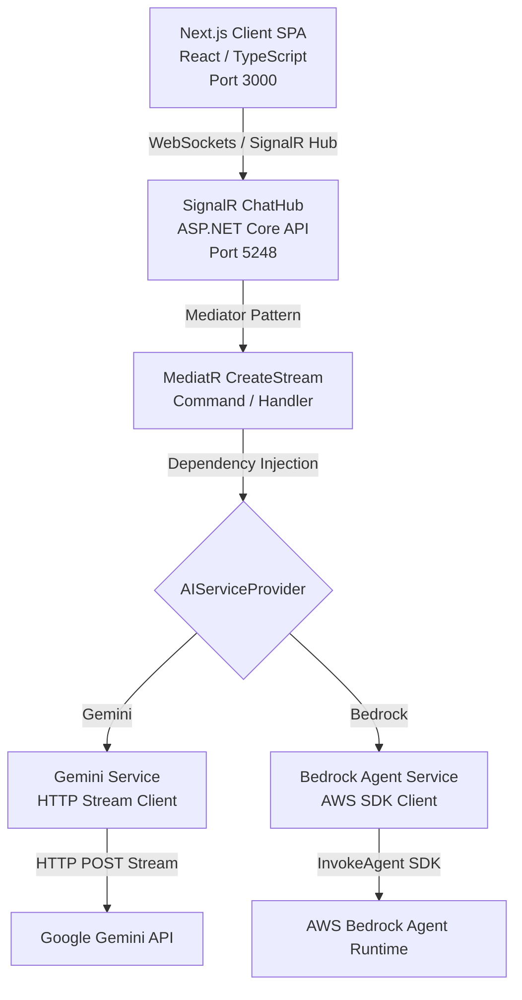
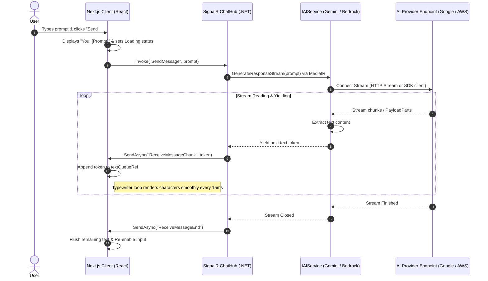

# WebSocket Real-Time Streaming Chat Architecture & Implementation

This document provides a comprehensive analysis of the project's technical architecture, codebase structures, real-time data flows, and configuration setup for the real-time AI streaming chat system.

---

## 🏗️ System Architecture

The application runs a decoupled Client-Server architecture over local loopback ports (`3000` and `5248`). The backend registers multiple AI providers and resolves them dynamically based on the application configuration.



### Real-Time Streaming Sequence
The sequence diagram below shows the lifecycle of a single prompt message:



---

## 🗂️ Codebase Structure

### 1. Backend: .NET Core 10 Web API (`ai-service`)

The backend codebase follows clean architecture principles, separating REST API endpoints, vertical features (CQRS/MediatR), abstractions, and infrastructure.

```
ai-service/
├── Controllers/
│   ├── ChatController.cs        # REST Controller (used for test HTTP GET queries)
│   └── HomeController.cs        # Basic status/test page controller
├── Features/                    # CQRS Pattern: Vertical Slices
│   └── Chat/
│       ├── Commands/            # SendMessage Command/Handler (MediatR)
│       └── DTOs/                # Data Transfer Objects
├── Hubs/
│   └── ChatHub.cs               # SignalR Hub managing WebSockets connection & events
├── Models/                      # Core Domain/Request models
├── Properties/
│   └── launchSettings.json      # Development host/port profiles (HTTP Port: 5248)
├── Services/
│   ├── Interface/
│   │   └── IAIService.cs        # Interface contract (Abstractions)
│   └── Implementations/
│       ├── GeminiService.cs     # Concrete implementation of Gemini API connection
│       └── BedrockAgentService.cs # Concrete implementation of Amazon Bedrock Agent
├── Program.cs                   # Pipeline setup (CORS, Hub routing, DI registration)
└── appsettings.json             # App configs and API Key definitions
```

### 2. Frontend: Next.js Client (`ai-service-next-ui`)

A modern single-page-app client bootstrapped with Next.js App Router, styled using Tailwind CSS v4 and written in TypeScript.

```
ai-service-next-ui/
├── public/                      # Static assets (favicons, icons)
├── src/
│   └── app/
│       ├── globals.css          # Base CSS and Tailwind imports
│       ├── layout.tsx           # Global Root layout config
│       └── page.tsx             # Main chat page containing React hooks and SignalR client
├── package.json                 # Dependency list (@microsoft/signalr, next, react, react-markdown)
└── tsconfig.json                # TypeScript compiler options
```

---

## ⚙️ Core Technical Implementation

### 1. Gemini Service (`GeminiService.cs`)
Uses standard `HttpClient` with streaming enabled to pull and parse content chunks:
```csharp
// Reads stream chunks line-by-line
while ((line = await reader.ReadLineAsync()) != null)
{
    var startIndex = line.IndexOf("\"text\":");
    if (startIndex >= 0)
    {
        var text = TryParseText(line.Substring(startIndex));
        if (!string.IsNullOrEmpty(text)) yield return text;
    }
}
```

### 2. Amazon Bedrock Agent Service (`BedrockAgentService.cs`)
Uses the official `AWSSDK.BedrockAgentRuntime` C# package to invoke and stream agents using `InvokeAgentRequest`:
```csharp
var request = new InvokeAgentRequest
{
    AgentId = agentId,
    AgentAliasId = agentAliasId,
    SessionId = sessionId,
    InputText = prompt
};

var response = await _client.InvokeAgentAsync(request);

await foreach (var eventStream in response.Completion)
{
    if (eventStream is PayloadPart payloadPart)
    {
        var chunk = Encoding.UTF8.GetString(payloadPart.Bytes.ToArray());
        if (!string.IsNullOrEmpty(chunk)) yield return chunk;
    }
}
```

### 3. Dynamic Registration (`Program.cs`)
Switch providers in `appsettings.json` dynamically at boot-time:
```csharp
var apiProvider = builder.Configuration["AIServiceProvider"] ?? "Gemini";
if (apiProvider.Equals("Bedrock", StringComparison.OrdinalIgnoreCase))
{
    builder.Services.AddSingleton<IAIService, BedrockAgentService>();
}
else
{
    builder.Services.AddHttpClient<IAIService, GeminiService>();
}
```

---

## 🚀 How to Run the Application

### Configuration (`appsettings.json`)
Configure your keys and preferred provider:
```json
{
  "AIServiceProvider": "Gemini", // Set to "Bedrock" to use AWS Bedrock Agents
  "Gemini": {
    "API": "YOUR_GEMINI_API_KEY"
  },
  "Bedrock": {
    "AgentId": "YOUR_AGENT_ID",
    "AgentAliasId": "YOUR_AGENT_ALIAS_ID"
  },
  "AWS": {
    "Region": "us-east-1",
    "AccessKeyId": "YOUR_AWS_ACCESS_KEY_ID",
    "SecretAccessKey": "YOUR_AWS_SECRET_ACCESS_KEY"
  }
}
```

### Execution
1. Run backend server: `dotnet run` (in `ai-service` directory)
2. Run Next.js frontend: `npm run dev` (in `ai-service-next-ui` directory)
3. Connect using the browser UI on `http://localhost:3000`.
