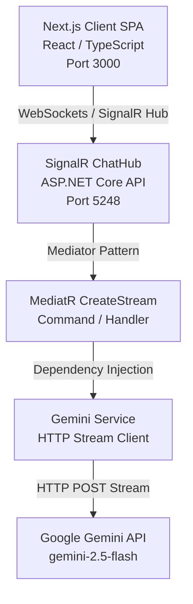
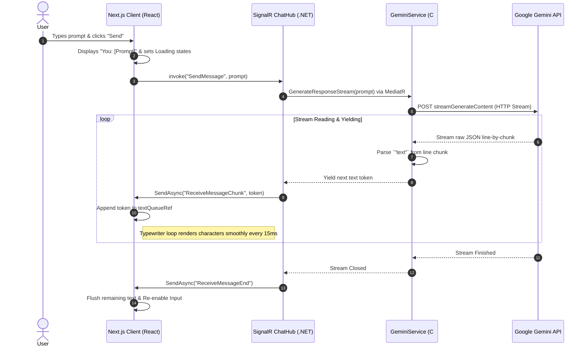

# WebSocket Real-Time Streaming Chat Architecture & Implementation

This document provides a comprehensive analysis of the project's technical architecture, codebase structures, real-time data flows, and configuration setup for the real-time AI streaming chat system.

---

## 🏗️ Architecture Diagrams

### System Architecture
The application runs a decoupled Client-Server architecture over local loopback ports (`3000` and `5248`):



### Real-Time Streaming Sequence
The sequence diagram below shows the lifecycle of a single prompt message:



---

## 🗂️ Codebase Structure

### 1. Backend: .NET Core 10 Web API (`ai-service`)

The backend codebase follows clean architecture principles, separating REST API endpoints, vertical features (CQRS/MediatR), abstractions, and infrastructure.

```
ai-service/
├── Controllers/
│   ├── ChatController.cs        # REST Controller (used for test HTTP GET queries)
│   └── HomeController.cs        # Basic status/test page controller
├── Features/                    # CQRS Pattern: Vertical Slices
│   └── Chat/
│       ├── Commands/            # SendMessage Command/Handler (MediatR)
│       └── DTOs/                # Data Transfer Objects
├── Hubs/
│   └── ChatHub.cs               # SignalR Hub managing WebSockets connection & events
├── Models/                      # Core Domain/Request models
├── Properties/
│   └── launchSettings.json      # Development host/port profiles (HTTP Port: 5248)
├── Services/
│   ├── Interface/
│   │   └── IAIService.cs        # Interface contract (Abstractions)
│   └── Implementations/
│       └── GeminiService.cs     # Concrete implementation of Gemini API connection
├── Program.cs                   # Pipeline setup (CORS, Hub routing, DI registration)
└── appsettings.json             # App configs and API Key definitions
```

### 2. Frontend: Next.js Client (`ai-service-next-ui`)

A modern single-page-app client bootstrapped with Next.js App Router, styled using Tailwind CSS v4 and written in TypeScript.

```
ai-service-next-ui/
├── public/                      # Static assets (favicons, icons)
├── src/
│   └── app/
│       ├── globals.css          # Base CSS and Tailwind imports
│       ├── layout.tsx           # Global Root layout config
│       └── page.tsx             # Main chat page containing React hooks and SignalR client
├── package.json                 # Dependency list (@microsoft/signalr, next, react, tailwindcss)
└── tsconfig.json                # TypeScript compiler options
```

---

## ⚙️ Core Technical Implementation

### 1. Backend Streaming Client (`GeminiService.cs`)
Instead of waiting for the full network response (which could take several seconds), `GeminiService` opens a stream reader using `HttpCompletionOption.ResponseHeadersRead` and parses the incoming stream line-by-line:

```csharp
public async IAsyncEnumerable<string> GenerateResponseStream(string prompt)
{
    var url = $"https://generativelanguage.googleapis.com/v1beta/models/{model}:streamGenerateContent?key=" + apiKey;
    var requestBody = new { contents = new[] { new { parts = new[] { new { text = prompt } } } } };

    using var request = new HttpRequestMessage(HttpMethod.Post, url)
    {
        Content = new StringContent(JsonSerializer.Serialize(requestBody), Encoding.UTF8, "application/json")
    };

    var response = await _httpClient.SendAsync(request, HttpCompletionOption.ResponseHeadersRead);
    using var stream = await response.Content.ReadAsStreamAsync();
    using var reader = new StreamReader(stream);

    string? line;
    while ((line = await reader.ReadLineAsync()) != null)
    {
        var startIndex = line.IndexOf("\"text\":");
        if (startIndex >= 0)
        {
            var text = TryParseText(line.Substring(startIndex));
            if (!string.IsNullOrEmpty(text)) yield return text;
        }
    }
}
```

### 2. MediatR CQRS Configuration (`Features/Chat`)
We leverage MediatR's stream handlers (`IStreamRequestHandler`) to decouple the hub from service endpoints:

* **Command** (`SendMessageCommand.cs`):
  ```csharp
  public record SendMessageCommand(string Message) : IStreamRequest<string>;
  ```

* **Handler** (`SendMessageCommandHandler.cs`):
  ```csharp
  public class SendMessageCommandHandler : IStreamRequestHandler<SendMessageCommand, string>
  {
      private readonly IAIService _aiService;
      public SendMessageCommandHandler(IAIService aiService) => _aiService = aiService;

      public IAsyncEnumerable<string> Handle(SendMessageCommand request, CancellationToken token)
      {
          return _aiService.GenerateResponseStream(request.Message);
      }
  }
  ```

### 3. SignalR Hub Streaming (`ChatHub.cs`)
Signals connection events back to the client using a real-time event pipeline:
```csharp
public class ChatHub : Hub
{
    private readonly IMediator _mediator;
    public ChatHub(IMediator mediator) => _mediator = mediator;

    public async Task SendMessage(string message)
    {
        var stream = _mediator.CreateStream(new SendMessageCommand(message));
        await foreach (var chunk in stream)
        {
            await Clients.Caller.SendAsync("ReceiveMessageChunk", chunk);
        }
        await Clients.Caller.SendAsync("ReceiveMessageEnd");
    }
}
```

---

## ⚛️ Frontend Implementation (`ai-service-next-ui`)

### 1. WebSocket Event Handling
The client establishes connection using `@microsoft/signalr` and registers two streaming listeners:
```typescript
conn.on("ReceiveMessageChunk", (chunk: string) => {
  setIsTyping(false);
  textQueueRef.current += chunk; // Push chunk to buffer
  startTypingLoop();             // Trigger typewriter effect
});

conn.on("ReceiveMessageEnd", () => {
  isStreamActiveRef.current = false;
});
```

### 2. Adaptive-Speed Typewriter Effect
To prevent layout jerkiness and maintain smooth output rendering, we use a character queue loop with variable speed parameters. If the queue length grows (e.g. backend sends tokens faster than they are being typed), it increases the number of characters printed per frame to catch up:

```typescript
const startTypingLoop = () => {
  if (typingIntervalRef.current) return;

  typingIntervalRef.current = setInterval(() => {
    if (textQueueRef.current.length > 0) {
      // Dynamic Speed Adjustments:
      const charsToType = textQueueRef.current.length > 100 
        ? 4 
        : textQueueRef.current.length > 50 
        ? 2 
        : 1;

      const chunk = textQueueRef.current.substring(0, charsToType);
      textQueueRef.current = textQueueRef.current.substring(charsToType);

      setMessages((prev) => {
        const lastMsg = prev[prev.length - 1];
        if (lastMsg && lastMsg.sender === "AI") {
          const updated = [...prev];
          updated[updated.length - 1] = { ...lastMsg, text: lastMsg.text + chunk };
          return updated;
        } else {
          return [...prev, { sender: "AI", text: chunk }];
        }
      });
    } else if (!isStreamActiveRef.current) {
      // Stream finished and queue is empty, clean up
      if (typingIntervalRef.current) {
        clearInterval(typingIntervalRef.current);
        typingIntervalRef.current = null;
      }
      setIsStreaming(false);
    }
  }, 15);
};
```

---

## 🚀 How to Run the Application

### Steps

1. **Run the Backend API Server**:
   ```bash
   cd c:\Users\user\source\repos\ai-service
   dotnet run
   ```
   * The server runs locally on **`http://localhost:5248`** and opens the SignalR Hub route at **`/chatHub`**.

2. **Run the Next.js Dev Client**:
   ```bash
   cd c:\Users\user\source\repos\ai-service-next-ui
   npm run dev
   ```
   * Open **`http://localhost:3000`** in any web browser.

3. **Establish connection**:
   * Click **Connect** on the modal overlay overlay.
   * Send your prompts and enjoy real-time typewriter-effect streaming!
